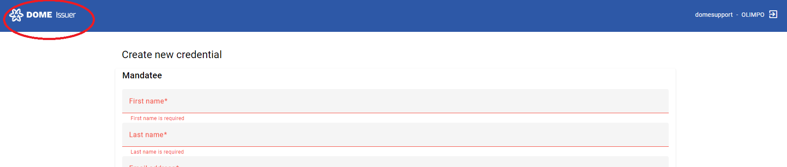
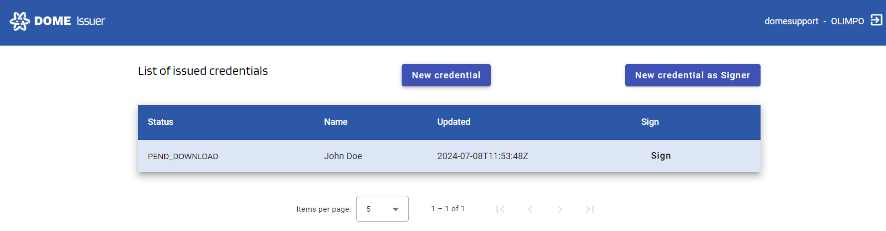

# Credential Issuer User Guide

## Login into the Credential Issuer

### Step 1: Access the Credential Issuer
Visit the Dome Marketplace by clicking on the following link: [Credential Issuer](https://dome-marketplace-dev.org).

Scroll down to the "Login as Legal Representative" button

### Step 2: Log In
Log In using your credentials.

You will enter the issued credentials list view:

## Issuance of LEAR Credential Employee with a Signer Account
Complete process of issuing a new LEAR Credential Employee. As a Signer account you can issue Credential on behalf of a Mandator that don't have available a Digital Certificate for the signature.
### Step 1: New Credential Form
To create a Verifiable Credential and signed it as IN2, click the "admincredential" button, which will take you to the creation form.

Fill in the details for the Mandatee and the Mandator (the current account will be only the Signer of the Credential)

You can add different powers in the last portion of the form using the combo box

Once complete click on "Create Credential" button. Go back to the list of Credentials by clicking the Dome Issuer logo in the left upper corner

We will see that the Credential we just created have a status of WITHDRAWN

### Step 2: Mandatee(Legal Representative) actions
At this point the Mandatee will receive an e-mail notification with the instructions and the link to download the Credential to his/her Wallet.
This link will be available for 10 minutes

When the Mandatee successfully download the Credential to the Wallet, the signer will receive an e-mail notification informing the signer to sign the Credential

At this stage the status of the Credential will change to ISSUED

### Step 3: Signing a Credential
If a Credential have an ISSUED status you can now proceed to sign the credential with the button "firma"

If you update the list you can now see the status changed to PEND_DOWNLOAD

At the same time the Mandatee will get an e-mail notification informing that the signed Credential is ready and can be downloaded in the Wallet

Once the Mandatee download the signed Credential you can see the updated and final status of the Credential in the Credential list as VALID

### Troubleshooting: Expired Credential Offer
From the moment of the creation of a new Credential the link for the Mandatee to download the Credential have a lifespan of 10 minutes.
If the Mandatee didn't download the Credential in that time or fails to do it there is an option to send a fresh e-mail notification to the Mandatee with the instruction and a new functional link to start the process.
To do so click on the status of the Credential access it's details

In the details view click the "Send Reminder" button

The Mandatee will receive the new email notification to start de process again

NOTICE: This solution is for the expiration of the link in the email notification. If the Mandatee gets to open the QR code and don't get to complete the process you need to contact support. Please create a ticket on [ticketing system](https://ticketing.dome-marketplace-dev.org/)

