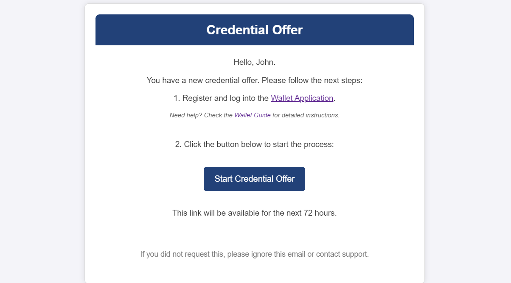
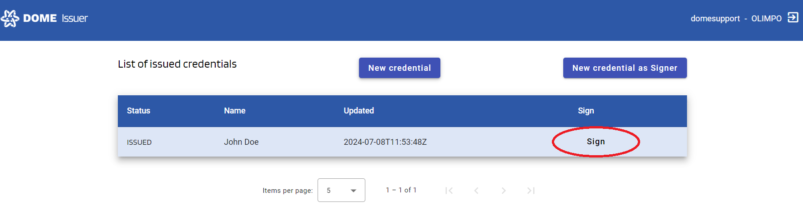

# Credential Issuer User Guide

## Introduction
The Credential Issuer is a crucial element in the onboarding process for new users to the DOME Marketplace. This application issues Verifiable Credentials, which are essential for accessing and interacting with the DOME Marketplace. These credentials are issued to users who then use the  [DOME Digital Wallet](https://wallet.dome-marketplace-prd.org/) to retrieve and store them securely.

## 1. Login into the Credential Issuer

- **Access the Credential Issuer**
    - Visit the DOME Issuer by clicking on the following link: [DOME Issuer](https://issuer.dome-marketplace-dev.org).
      

- **Access the Login**
    - Scroll down to the "**Login as Legal Representative**" button
      

- **Log In.**
  - Enter with your credentials.
    

- **You will enter the issued credentials list view**
    - In the initial view you can see all the issued credentials by the current user/organization:
      

## 2. Issuance of a Credential with a Signer Account
- **New Credential Form**
    - To create a Verifiable Credential, click the "**New credential as Signer**" button, which will take you to the creation form.
      

- **Complete the New Credential Form**
    - Fill in the details (the current account will be only the Signer of the Credential)
      

- **Adding Powers to the Credential Subject**
    - You can add different powers in the last portion of the form using the combo box
      

- **Create Credential**
    - Once complete click on "**Create Credential**" button. Go back to the list of Credentials by clicking the Dome Issuer logo in the upper left corner
      

- **See Result**
  - **We will see that the Credential we just created have a status of **WITHDRAWN****

      

## 3. Credential Subject actions
- **Credential Subject Email notification**
  - At this point the Credential Subject will receive an e-mail notification with the instructions and the link to download the Credential to his/her Wallet.
  This link will be available for 10 minutes

      
- **Signer Email notification**
  - When the Credential Subject successfully download the Credential to the Wallet, the signer will receive an e-mail notification informing the signer to sign the Credential

      

- **Updated Credential status**
  - At this stage the status of the Credential will change to **ISSUED**

      

## 4. Signing a Credential
- **Credential to sign**
  - If a Credential have an ISSUED status you can now proceed to sign the credential with the button "**Sign**"

      

- **Check updated Credential status**
  - If you update the list you can now see the status changed to **PEND_DOWNLOAD**

      

- **Credential Subject Email notification**
  - At the same time the Credential Subject will get an e-mail notification informing that the signed Credential is ready and can be downloaded in the Wallet

      

- **Credential Subject download signed Credential**
  - Once the Credential Subject download the signed Credential you can see the updated and final status of the Credential in the Credential list as **VALID**

      

- **The issuance of a Valid Verifiable Credential is now completed.**

## Troubleshooting: Expired Credential Offer
- From the moment of the creation of a new Credential the link for the Credential Subject to download the Credential have a lifespan of 10 minutes.
If the Credential Subject didn't download the Credential in that time or fails to do it there is an option to send a fresh e-mail notification to the Credential Subject with the instruction and a new functional link to start the process.
To do so click on the status of the Credential to access its details

    

- In the details view click the "**Send Reminder**" button

    

- The Credential Subject will receive the new email notification to start de process again

    

For any other issues you can contact the technical support team by creating a ticket on [ticketing system](https://ticketing.dome-marketplace-dev.org/)

